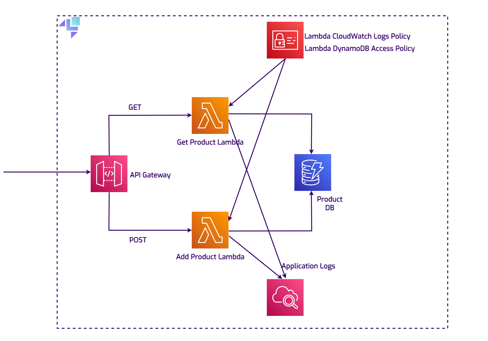

# Cloud Pods Collaboration Demo

A sample product API built with API Gateway, Lambda (Java), and DynamoDB, designed for collaborative debugging workflows using LocalStack Cloud Pods. Follow the end-to-end walkthrough for this project: https://docs.localstack.cloud/aws/tutorials/cloud-pods-collaborative-debugging/



## Prerequisites

- A valid [LocalStack for AWS license](https://localstack.cloud/pricing), which provides a [`LOCALSTACK_AUTH_TOKEN`](https://docs.localstack.cloud/aws/getting-started/auth-token/) required to run this sample.
- [Docker](https://docs.docker.com/get-docker/) for running LocalStack.
- [Maven](https://maven.apache.org/install.html) and [Java 21](https://adoptium.net/) for building the Lambda functions.
- [Terraform](https://developer.hashicorp.com/terraform/install) or [OpenTofu](https://opentofu.org/docs/intro/install/) with [`lstk`](https://docs.localstack.cloud/aws/developer-tools/running-localstack/lstk/), installed via `npm install -g @localstack/lstk` or `brew install localstack/tap/lstk`.

```bash
export LOCALSTACK_AUTH_TOKEN=<your-auth-token>
```

## Sample Variants

- [Terraform sample](terraform/main.tf)
- [OpenTofu sample](opentofu/main.tf)

## Quick Start

1. Start LocalStack:

```bash
docker compose up -d
```

2. Build Lambda artifacts:

```bash
cd lambda-functions
mvn clean package
```

3. Deploy infrastructure:

```bash
cd terraform
./run-tflocal.sh
```

4. Invoke the API:

```bash
./invoke.sh
```

For OpenTofu, set `TF_CMD=tofu` and run `lstk tf` in `opentofu/` (see `opentofu/instructions.md`).

## License

Licensed under Apache License 2.0. See [LICENSE](LICENSE).
